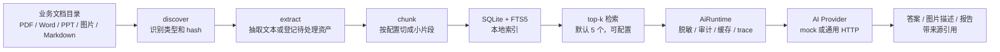

# learnBusiness

`learnBusiness` 是一个用 Rust 编写的业务文档理解智能体。它面向本地的一堆业务资料工作：先在本机完成发现、抽取、切块、索引、检索和审计，只把最相关的少量 chunk 交给可配置的 AI 接口，从而兼顾速度、成本、token 消耗和安全边界。

这个项目的核心不是“把所有文件都丢给大模型”，而是把业务文档先整理成一个可检索、可追踪、可扩展的本地工作区，再按需调用 AI。

## 适合解决什么

- 业务资料散落在 PDF、Word、PPT、Markdown、文本和图片里，需要快速建立可问答索引。
- 文档里有流程、规则、术语、接口说明或制度材料，需要让 agent 带来源引用地回答。
- 需要接 AI 接口，但不能无节制发送全文、图片正文、密钥或日志明文。
- 未来可能接入企业网关、云端 AI、多模态接口、localhost 服务、skill 或 MCP。
- 希望先保持轻量：一个 Rust CLI、一个 SQLite 数据库、一个本地工作区就能跑起来。

## 工作流



## 快速开始

```powershell
cargo run --bin learnBusiness -- init .\workspace
cargo run --bin learnBusiness -- ingest .\docs --workspace .\workspace
cargo run --bin learnBusiness -- ask --workspace .\workspace "这个业务的核心流程是什么？"
cargo run --bin learnBusiness -- report --workspace .\workspace --out report.md
```

默认 provider 是 `mock`，适合先验证索引、问答链路、审计和报告输出，不会发起外部网络请求。

## 工作区结构

`init` 会在目标目录下创建 `.learnBusiness/`，所有运行时配置、索引、缓存、artifact 和日志都集中放在这个目录里：

```text
.learnBusiness/
  config/
    app.toml
  metadata.sqlite
  fulltext/
  vectors/
  artifacts/
  cache/
  logs/
```

`.learnBusiness/` 已加入 `.gitignore`。本地配置、AI 缓存、索引、日志和潜在敏感材料不会被默认提交到公开仓库。

## 核心能力

- 本地工作区：配置集中在 `.learnBusiness/config/app.toml`，数据、缓存和日志按用途隔离。
- 文档发现：识别 `txt`、`md`、`pdf`、常见图片、`docx`、`pptx`，并记录 hash 与基础元数据。
- 文本抽取：支持纯文本、Markdown 和基础 PDF 文本抽取。
- 轻量分片：长文本按 `performance.chunk_char_limit` 切块，默认 1600 字符。
- 本地索引：使用 SQLite 保存文档、chunk 和 AI 调用审计，使用 FTS5 做全文检索。
- 省 token 问答：只把 `performance.context_chunks` 个相关 chunk 交给 AI，默认 5，最大 20。
- 多模态预留：`describe-image` 通过 `AiRuntime` 调用多模态 HTTP 接口；`--dry-run-ai` 只记录计划，不发送图片。
- 报告输出：生成包含执行摘要、资料集概览、流程候选和来源引用的 Markdown 报告。
- 扩展点：保留 AI provider、skill、MCP、向量检索、OCR 和更强文档解析能力的接入位置。

## AI Provider

`learnBusiness` 只内置两个 provider 类型：

| provider | 用途 | 行为 |
| --- | --- | --- |
| `mock` | 离线开发、测试、审计链路验证 | 不出网，不需要密钥 |
| `http` | 调用可配置 AI HTTP 接口 | `base_url`、模型名和请求头全部由配置决定 |

`http` 只表示“通过 HTTP 调 AI”。`base_url` 可以是 `http://localhost:8000/v1`，也可以是企业网关或云端兼容接口。这里的 `localhost` 只是地址，不等于必须本地部署大模型。

示例配置：

```toml
[ai]
provider = "http"
base_url = "http://localhost:8000/v1"
chat_model = "business-chat"
vision_model = "business-vision"
embedding_model = "business-embedding"
api_key_env = ""

[ai.headers]
Authorization = "Bearer ${LEARNBUSINESS_AI_KEY}"
X-App = "learnBusiness"

[performance]
context_chunks = 5
chunk_char_limit = 1600
```

`[ai.headers]` 支持 `${ENV_NAME}` 环境变量占位符。运行时只会解析并发送 header 值，不会把真实 header 值写入 SQLite、缓存 key 或 trace 日志。

## 为什么有 AiRuntime

`AiRuntime` 是所有 AI 调用的统一入口。它负责把跨 provider 的共同约束集中执行一次：

- 配置读取和 provider 构造。
- top-k chunk 数量和单 chunk 长度限制。
- 外部 HTTP 调用前的脱敏判断。
- token 估算、缓存 key、审计记录和 trace 日志。
- 错误分类，避免排障时只能看到一条泛化失败信息。

如果每个命令直接调用 provider，`ask`、`describe-image`、后续摘要和 embedding 很容易各自漏掉脱敏、审计、缓存或日志策略。`AiRuntime` 的作用就是让所有 AI 路径都经过同一条安全和可观测边界。

## 安全与性能取舍

- 默认不出网：初始配置使用 `mock`。
- 密钥不落盘：推荐用环境变量占位符配置请求头。
- 少发上下文：问答只发送检索命中的 top-k chunk。
- 不写原文日志：审计和 trace 只保存 provider、model、purpose、hash、状态、token 估算、失败类别和脱敏标记。
- 本机端点可配：loopback `base_url` 会被识别为本机地址，但它只影响脱敏策略判断，不绑定任何特定模型产品。
- HTTP client 默认关闭环境代理，降低 localhost 请求被系统代理劫持的风险。

## 当前边界

- Word、PPT 和图片当前主要完成类型识别和资产登记，正文抽取、OCR 和版面理解是后续增强方向。
- 向量目录已经预留，当前检索主路径仍是 SQLite FTS5。
- report 是轻量业务报告草稿，不等同完整业务建模或流程挖掘系统。
- redaction 当前是规则级脱敏，覆盖邮箱、手机号、长数字和常见 `sk-` 样式密钥。

## 文档导航

- [操作手册](docs/operation-manual.md)：安装、初始化、导入、问答、报告、图片 dry-run、AI 配置和排障。
- [数据文档](docs/data-documentation.md)：工作区目录、SQLite 表、FTS、缓存、生命周期和隐私边界。
- [架构文档](docs/architecture.md)：模块职责、数据流、安全边界、扩展点、AiRuntime 和性能策略。
- [设计说明](docs/superpowers/specs/2026-06-14-learnBusiness-design.md)：第一版设计目标和边界。
- [实现计划](docs/superpowers/plans/2026-06-14-learnBusiness.md)：已完成能力和后续增强方向。

## 开发验证

```powershell
cargo fmt -- --check
cargo clippy --all-targets -- -D warnings
cargo test
openspec validate --all
```
