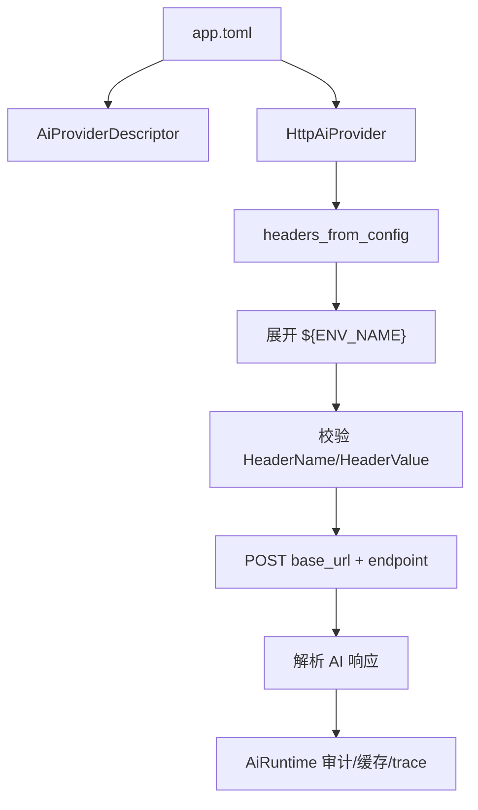

# learnBusiness 架构文档

## 项目定位

learnBusiness 是一个本地优先的业务文档理解工具，用于把散落在本机目录中的业务资料转成可检索、可问答、可审计的工作区索引。输入对象优先考虑 PDF、文本、Markdown、图片、Word、PPT 等业务资料，而不是代码仓库。

核心目标是轻量、省 token、安全和可扩展：

- 本地优先：发现、抽取、切块、索引、检索、审计和报告默认在本机完成。
- 轻量：使用 Rust CLI、SQLite、FTS5 和文件缓存，避免一开始引入重型服务。
- 省 token：先用本地检索缩小上下文，只把少量 top-k chunk 交给 AI。
- 安全：配置不保存密钥值；日志、缓存 key 和审计只保存元数据、hash、状态和错误分类。
- 可扩展：AI、skill、MCP 和多模态处理通过明确接口接入。

## 工作区结构

`workspace` 模块把用户指定目录视为根目录，并在其下维护 `.learnBusiness/`：

```text
.learnBusiness/
  config/
    app.toml
  metadata.sqlite
  fulltext/
  vectors/
  artifacts/
    images/
    pages/
    thumbnails/
  cache/
    ai/
    extraction/
  logs/
    trace.jsonl
```

除用户显式指定的报告输出路径外，运行时状态应尽量留在 `.learnBusiness/` 内。该目录不应提交到公开仓库。

## 配置模型

配置文件固定为 `.learnBusiness/config/app.toml`，当前包含：

- `[ai]`：`provider`、`base_url`、`chat_model`、`vision_model`、`embedding_model`、`api_key_env`。
- `[ai.headers]`：任意 HTTP 请求头，值可以使用 `${ENV_NAME}` 环境变量占位符。
- `[safety]`：`redact_before_external_ai`、`dry_run_ai`。
- `[performance]`：`context_chunks`、`chunk_char_limit`。
- `[logging]`：`trace_enabled`。

默认 provider 是 `mock`，不会出网。真实 AI 接口使用 `provider = "http"`，通过可配置 `base_url` 连接本机端点、企业网关或云端兼容接口。`localhost` 只是地址含义，不代表必须本地部署模型。

`api_key_env` 是兼容快捷方式：如果没有显式配置 `Authorization` 请求头，但设置了 `api_key_env`，运行时会自动生成 `Authorization: Bearer <环境变量值>`。新配置推荐直接使用 `[ai.headers]`。

## 模块职责

### main

CLI 编排层，解析 `init`、`ingest`、`status`、`inspect-ai`、`report`、`ask`、`describe-image` 命令，并把实际工作交给具体模块。

### workspace

创建和定位 `.learnBusiness/`，暴露配置、SQLite、缓存、artifact 和 trace 日志路径。

### discover

扫描业务文档目录，识别支持的文件类型，计算文件 SHA-256，并记录文件大小和基础类型。

### ingest / extract

`ingest` 串联发现、抽取、增量判断、切块和入库。`extract` 将文本、Markdown、基础 PDF、`.docx` 段落文本和 `.pptx` 幻灯片文本转成可索引文本；图片和无法直接抽取正文的资产登记为需要后续 AI/OCR 或多模态补全。

### store

SQLite 持久化层，管理：

- `documents`：文档路径、类型、内容 hash、大小、导入状态。
- `chunks`：chunk 文本、页码、幻灯片、artifact 路径、置信度、AI 生成标记。
- `chunks_fts`：SQLite FTS5 全文索引。
- `ai_calls`：AI 调用审计记录，不保存原始 prompt 或完整输出。

### ai

AI 抽象层由以下部分组成：

- `AiProvider` trait：统一图片理解、chunk 摘要、embedding 和问答接口。
- `MockAiProvider`：确定性离线 provider，用于默认验证和测试。
- `HttpAiProvider`：通用 HTTP provider，使用配置的 `base_url` 和 `[ai.headers]`，文本、embedding、多模态请求共用同一套请求头。
- `http.rs`：共享 blocking HTTP JSON 调用、URL 拼接和请求头校验。
- `runtime.rs`：统一 AI 调用网关。
- `cache.rs`：根据 provider、model、purpose、prompt version、content hash 和脱敏状态生成缓存 key。
- `redaction.rs`：外部 AI 调用前的基础脱敏。

`HttpAiProvider` 当前采用 chat completions/embeddings 兼容 JSON 形状作为默认协议：`/chat/completions` 用于问答和图像理解，`/embeddings` 用于 embedding。后续如果要接其他协议，应优先新增 provider adapter 或协议配置，不要绕过 `AiRuntime`。

## AiRuntime 的作用

`AiRuntime` 是所有 AI 行为的统一入口。它不是为了把复杂度集中在一个大类里，而是为了把跨 provider 的共同约束只实现一次：

- 读取并校验配置。
- 构造 provider descriptor。
- 控制 top-k chunk 数量和单 chunk 长度。
- 判断是否需要对外部 HTTP 目标脱敏。
- 估算 token。
- 写入 AI 调用审计。
- 写入结构化 trace 日志。
- 失败时记录错误分类。
- 成功时写入 AI 缓存。

如果每个命令直接调用 provider，就会重复处理密钥、脱敏、token、日志、缓存和错误分类，很容易出现某条路径漏审计或泄漏原文。`AiRuntime` 保证 `ask`、`describe-image` 和后续摘要/embedding 流程共享同一条安全边界。

## HTTP Provider 数据流



关键点：

- `base_url` 完全由配置决定，只要求是有效 `http` 或 `https` URL。
- loopback 地址只用于判断是否为本机端点，从而影响默认脱敏策略；它不代表本地模型。
- 请求头值在真实请求前解析；缺失环境变量会在发网络请求前失败，并进入审计和 trace。
- 请求头值不会写入 SQLite、缓存 key 或 trace。
- HTTP client 默认关闭环境代理，避免本机端点请求被系统代理劫持。

## 主要数据流

### init

`main` -> `Workspace::init` -> 创建 `.learnBusiness/` 和默认 `app.toml`。

### ingest

`main` -> `run_ingest` -> `discover` -> `extract` -> `store.documents/chunks/chunks_fts`。

### ask

`main` -> `qa` -> `AiRuntime::answer` -> `store.search_text` -> top-k/截断/脱敏 -> `AiProvider.answer` -> `store.ai_calls` -> answer + structured citations。

### describe-image

`main` -> `AiRuntime::describe_image` -> 图片 hash/MIME -> dry-run 审计或 `AiProvider.describe_image` -> `store.ai_calls` -> `cache/ai`。

### inspect-ai

`main` -> `store.list_ai_calls` -> 可选按 `--trace <trace_id>` 过滤 -> 输出 provider、model、purpose、status、trace id、hash、token、redaction、error_category。

## 权限网关

`task` 模块定义命令级权限策略，CLI 命令在执行主体前统一校验：

- `init`：需要 `WriteWorkspace`。
- `ingest`：需要 `ReadLocal` 和 `WriteWorkspace`。
- `status`、`inspect-ai`：需要 `ReadLocal`。
- `report`：需要 `ReadLocal` 和 `WriteWorkspace`。
- `ask`：需要 `ReadLocal`、`WriteWorkspace` 和 `AiExternal`。
- `describe-image --dry-run-ai`：需要 `ReadLocal` 和 `WriteWorkspace`。
- 非 dry-run `describe-image`：额外需要 `AiExternal` 和 `ExternalNetwork`。

当前默认 CLI 授权集面向本机可信执行，包含本地读写和外部 AI/网络权限；`McpExternal` 已预留给后续 MCP 工具，避免外部工具绕过统一授权边界。

## 安全边界

- `.learnBusiness/` 不提交到仓库。
- `app.toml` 不保存真实密钥值。
- `[ai.headers]` 允许保存 header 名和环境变量占位符，不应保存真实 token。
- `ai_calls` 和 `trace.jsonl` 不保存 prompt、chunk 正文、图片 base64、请求头值或 provider 完整返回体。
- 远程 HTTP provider 默认走脱敏；loopback HTTP 端点默认不强制脱敏，但仍只保存审计元数据。
- 图片 base64 只进入 provider 请求体，不进入审计或 trace。

## 性能策略

- 增量 ingest：用文件 content hash 跳过未变化文档。
- 稳定 ID：文档和 chunk 使用稳定 hash/UUID，便于替换和缓存。
- 有界切块：默认 `chunk_char_limit = 1600`。
- 有界上下文：默认 `context_chunks = 5`，运行时限制在 1 到 20。
- 空命中短路：没有检索来源时不调用 AI。
- AI 缓存：按 provider、model、purpose、prompt version、content hash 和脱敏状态隔离。

## 扩展点

- AI provider：实现 `AiProvider` trait，并通过 descriptor/工厂接入 `AiRuntime`。
- HTTP 协议：当前默认 chat completions/embeddings 兼容 JSON；其他协议应作为 adapter 接入，仍复用配置、脱敏、审计和 trace。
- MCP：通过 `task` 权限模型声明外部能力，避免未授权访问外部系统。
- skill：适合承载领域流程和 prompt 模板，例如合同审查、采购流程梳理、系统手册问答。

## 当前限制

- Word、PPT 已支持 Office Open XML 正文抽取；复杂版面、嵌入图片、备注、扫描件 OCR 和图片内容入库仍待后续增强。
- 向量目录已预留，但当前检索主要依赖 SQLite FTS5。
- report 是轻量报告草稿，不等同完整业务建模。
- redaction 当前是正则级脱敏，只覆盖常见邮箱、手机号、长数字和 `sk-` 样式密钥。
- 权限模型已接入 CLI 命令入口；后续需要从配置或任务描述加载更细的授权策略。
